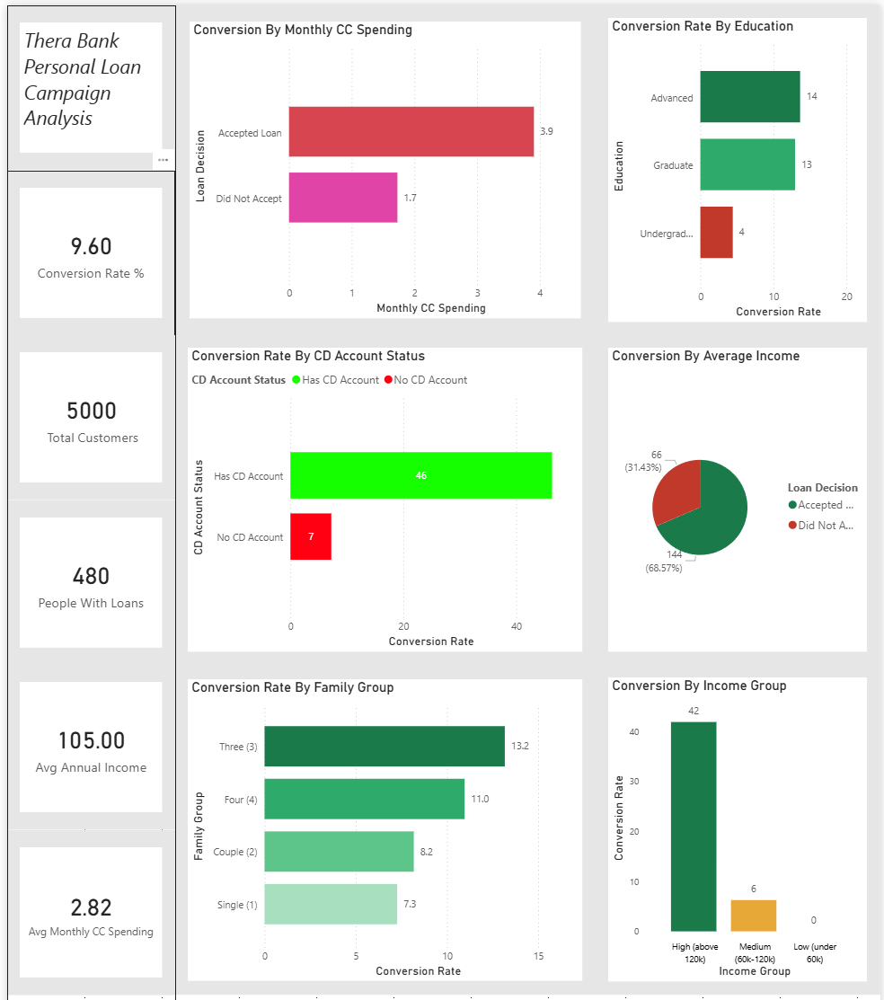

# thera-bank-loan-analysis
SQL &amp; Power BI analysis identifying high-conversion customer segments for a bank personal loan campaign | SQL Server · Power BI
# Thera Bank — Personal Loan Campaign Analysis

## Overview
Thera Bank ran a personal loan campaign last year and achieved a 9.6% conversion rate.
This project analyzes 5,000 customer records to identify which customer segments are most
likely to accept a personal loan — so the bank can target them more effectively next campaign
without increasing the budget.

## Tools Used
- SQL Server (SSMS) — data analysis and querying
- Power BI — dashboard and visualization

## Dataset
- Source: Kaggle — Bank Personal Loan Modelling
- 5,000 customer records
- 14 columns including income, education, family size, CD account status, credit card spending

## Business Questions Answered
1. What is the overall loan conversion rate?
2. Which income group converts the most?
3. Does education level affect loan acceptance?
4. Do larger families accept loans more?
5. What is the financial profile of customers who accept loans?
6. Do CD account holders accept loans more?

## Key Findings
- Overall conversion rate is 9.6% — only 480 out of 5,000 customers accepted
- High income customers (120k+) convert at 41.9% vs 0% for low income
- CD Account holders convert at 46% vs 7% for non-holders — strongest predictor
- Graduate and Advanced degree customers convert 3x more than undergraduates
- Families of 3+ are twice as likely to accept compared to single customers
- Customers who accepted earn on average $144k vs $66k for those who did not

## Ideal Target Customer Profile
Based on the analysis the bank should focus its next campaign on customers who match:
- Income above $120,000
- Graduate or Advanced degree
- Family size of 3 or more
- Has an existing CD account with the bank

Targeting this segment can push conversion rates from 9.6% to 40%+ without increasing budget.

## Dashboard

## Files
| File | Description |
|------|-------------|
| Thera_Bank_Loan_Analysis.sql | All SQL queries with findings and recommendations |
| Thera_Bank_Loan_Analysis.pbix | Power BI dashboard file |
| Bank_Loan_Clean.csv | Cleaned dataset used for analysis |
| Thera_Bank_Dashboard_Screenshot.PNG | Dashboard screenshot |
